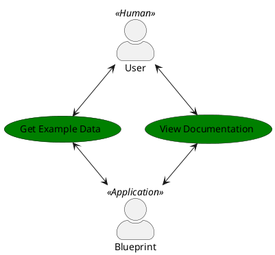
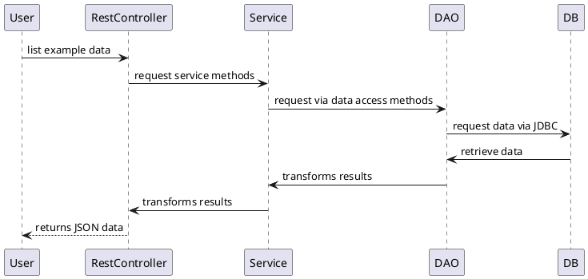
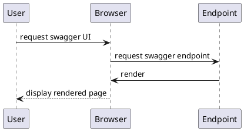

# blueprint

Blueprint application

## Prerequisites

For running the application:

* Docker >= 24.0.5 (with BuildKit enabled)

For developing:

* Maven >= 3.9.9
* Java >= 21

## Setup

You can set up the ``server.port`` in the ``application.properties``. The default is ``8080``. 

If the port is changed please also change the ``SERVICE_PORT_EXPOSE`` in the ``.env`` file for the ``blueprint`` service.

You can also change the database port via the property ``MARIADB_PORT_EXPOSE``. If you did, please change also the
``spring.datasource.url`` property according the port in the ``application.properties`` files.

Also, you can change the directory where the application stores its data via the property ``DATA_DIR`` in the ``.env`` file.

## Run the application

Open a console and go to the project dir. Then execute following commands to start the application:

``DOCKER_BUILDKIT=1 docker-compose build``
``docker-compose up -d``

## Stop the application

Open a console and go to the project dir. Then execute following command to stop the application:

``docker-compose down``

## Open API docs

The rest API of the application is documented on the following link which can be opened in a browser:

*http://localhost:8080/swagger-ui/index.html*

An open API compatible schema can be downloaded by GETting the link:

*http://localhost:8080/api-docs*

Note: please change the port when developing to *8088*

## Database

The database is reachable outside of Docker on host ``localhost`` and port ``.env.MARIADB_PORT_EXPOSE``

## Logs

Logs can be displayed with use of the following command:

For the database:

``docker logs blueprint-maria-db``

For the application:

``docker logs blueprint-service``

## Access the containers

You can also access the container with a `bash` like:

``docker exec -it blueprint-service bash``

or 

``docker exec -it blueprint-maria-db bash``

## Development

To start the application for developing please make sure you use the *application-dev.properties*. 
Like in the following command:

``
java -jar target/blueprint.jar -Dspring.config.location=src/main/resources/application-dev.properties
``

## Automated Tests

The application is tested completely automatically with executing a *mvn clean package*

There are different kind of tests:

* unit tests (JUnit)
* (database) integration tests (DBUnit / Testcontainers)
* cloud contract tests (Spring CDC / Testcontainers)

## Behind a proxy like Zscaler

If you're behind a proxy, please use the trust all flag, with adding `--build-arg INSECURE=1` to the `docker build` 
command, only for this demo purpose of course.

## FAQ on Docker

### (Linux) Socket is not reachable / Tests could not get a valid Docker environment

Check that your user has been added to the docker group. The goal is, that you should be able to execute `docker` without `sudo`.

Please check this one: https://docs.docker.com/engine/install/linux-postinstall/

### (Windows / WSL) Socket is not reachable

Where Docker daemon is running in Windows and used by the WSL is the most efficient way nowadays, it can happen that WSL 
cannot access the sock file to use Docker. 

In that case the `docker.sock` will not be on `/var/run`, or it will be some kind of invalid.

Go to `/var/run` and run:

`sudo rm docker.sock && sudo ln -s /mnt/wsl/docker-desktop/shared-sockets/guest-services/docker.sock /var/run/docker.sock`

Note on that, the path in `/mnt` to the sock file could vary.

Afterward you can run into the problem that you cannot execute Docker without `sudo`. Then simply check the instructions 
of the step `(Linux) Socket is not reachable / Tests could not get a valid Docker environment`.

## Library updates

Let's keep the thing up-to-date. But how to do it with all those libs?

You can use Mavens built-in tools for that:

Note: Be a bit careful here. I strongly suggest to not use release candidates, milestones, alpha or beta version.

### Updating minor versions

``mvn versions:update-parent versions:use-latest-releases versions:update-properties versions:commit -DallowMajorUpdates=false``

### Updating major versions

``mvn versions:update-parent versions:use-latest-releases versions:update-properties versions:commit -DallowMajorUpdates=true``

### Updating plugin versions

``mvn versions:display-plugin-updates -U``

### Code Formatting

To prevent formatting issues in further PR's there is *spotless* enabled by default.

In any cases of formatting problems during the build you can just apply the correct formatting by:

``mvn spotless::apply``

## Software Architecture

### Introduction and Goals

This document is showing the architecture of an example application.

The two main goals are focussed:

* the system is delivering example data on demand
* the system documentation is auto-generated 

### Requirements Overview



The goals are reflecting in two use cases:

* a list of examples can be retrieved by a browser request
* an OpenAPI documentation is auto-generated and accessible by a browser

### System Scope and Context

### Solution Strategy

* a REST API is used for retrieving the data
* an OpenAPI endpoint is available
* the system is using a layered architecture
* example data is stored in a relational database

### Building Block View

#### Whitebox Overall System

```plantuml
@startuml LAYOUT_LEFT_RIGHT
!include https://raw.githubusercontent.com/plantuml-stdlib/C4-PlantUML/master/C4_Container.puml
title Blueprint High Level

AddElementTag("notinscope", $fontColor=$ELEMENT_FONT_COLOR, $bgColor="#grey", $shape=EightSidedShape(), $legendText="notinscope")
AddElementTag("new", $fontColor=$ELEMENT_FONT_COLOR, $bgColor="#green", $shape=EightSidedShape(), $legendText="component")
AddElementTag("ui", $fontColor=$ELEMENT_FONT_COLOR, $bgColor="#335CAF", $legendText="ui")

Person(user, "User")

System_Boundary(application, "Blueprint Service") {
  Container(backend, "Backend", "Java", "Provides endpoints to get example data from the database", $tags="new")
}

System_Boundary(db, "Blueprint Database") {
    ContainerDb(database, "Database", "Relational", "")
}

BiRel(user, backend, "Browser", "HTTP/HTTPS")
BiRel_U(backend, database, "JDBC", "")

SHOW_LEGEND()
@enduml
```

#### Backend

```plantuml
@startuml
!include https://raw.githubusercontent.com/plantuml-stdlib/C4-PlantUML/master/C4_Component.puml
title Blueprint Backend Component

ContainerDb(database, "Database", "Relational Database Schema", "Stores example data")

Person(user, "Consumer", "People / application that need example data")

Component(rest, "RestController", "Java", "Provides endpoints to retrieve example data from the service")
Component(service, "Service", "Java", "Provides logics to retrieve example data from the DAO")
Component(dao, "DAO", "Java", "Provides logics to retrieve example data from the database")

BiRel(user, rest, "use", "JSON")
BiRel(rest, service, "access service", "transformation")
BiRel(service, dao, "access dao", "transformation")
BiRel_L(database, dao, "JDBC", "access example data")

@enduml
```

### Rest Controller

The rest controller receives a JSON HTTP/S request and is responding results alsa in JSON. It transforms the request 
regarding the interface of the service and uses it to get the results. The results will be transformed to JSON at last.

### Service

The service receives a call and transforms it regarding the interface of the DAO. Then it uses it to get the results. 
The results will be transformed regarding the service interface and passed back to the rest controller.

### DAO

The DAO receives a call and transforms it to entities regarding the JDBC interface. Then it requests the database and 
transforms the results from the database to entities. To pass back the results to the consumer of the DAO method, they 
will be transformed regarding the DAO interface.  

### Runtime View

#### List example data



#### Access OpenAPI documentation



### Deployment View

```plantuml
@startuml
!include https://raw.githubusercontent.com/plantuml-stdlib/C4-PlantUML/master/C4_Deployment.puml

WithoutPropertyHeader()

title Deployment Diagram for Blueprint Application - Demo

Deployment_Node(blueprint, "Blueprint", "Application", "Docker Network"){
    Container(backend, "Blueprint Application", "Java / Spring Boot", "Provides example data / documentation in a JSON/HTTP Rest API")
    ContainerDb(db, "Database", "Relational Database Schema", "Stores all example data")
}

Deployment_Node(appNode, "External application instances", "Any OS") {
    Deployment_Node(appNodeRest, "Rest", "Json/HTTPS"){
        Container(appContainer, "External Applications / Users", "Any programming language / browsers", "Access all the Blueprint API functionality to end users") #Gray
    }
}

Rel(appContainer, backend, "Makes API calls to", "Json/HTTPS")
Rel(backend, db, "Reads from and writes to", "JDBC")

@enduml
```

### Cross-Cutting Concepts

#### Transformation between the layers

Each layer provides a specific interface regarding input and output objects. This transformation is solved with 
MapStruct.

### Glossary

...